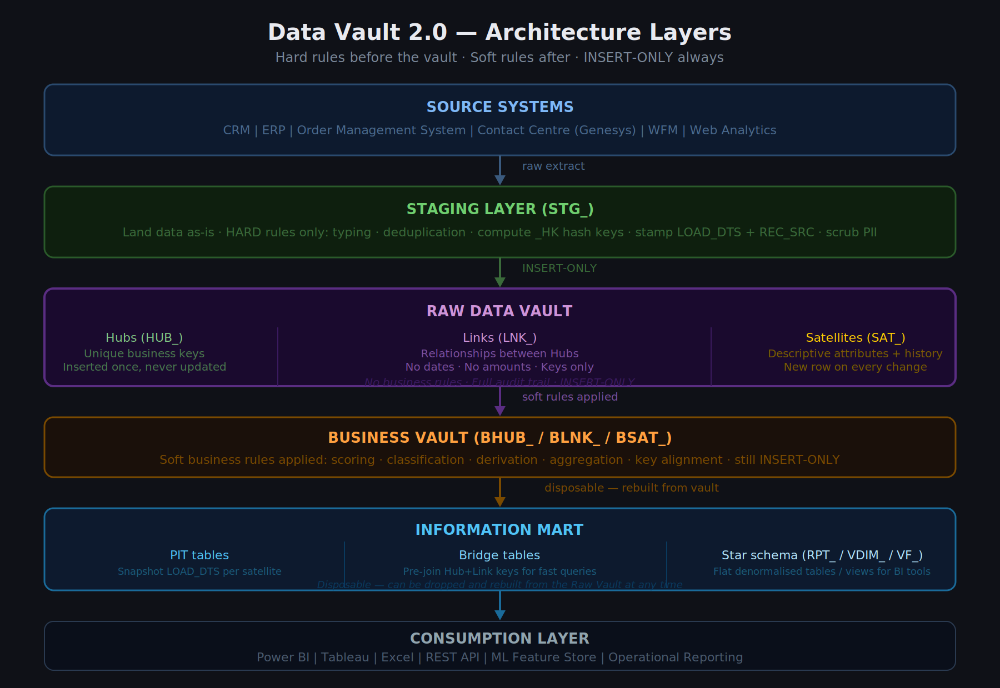
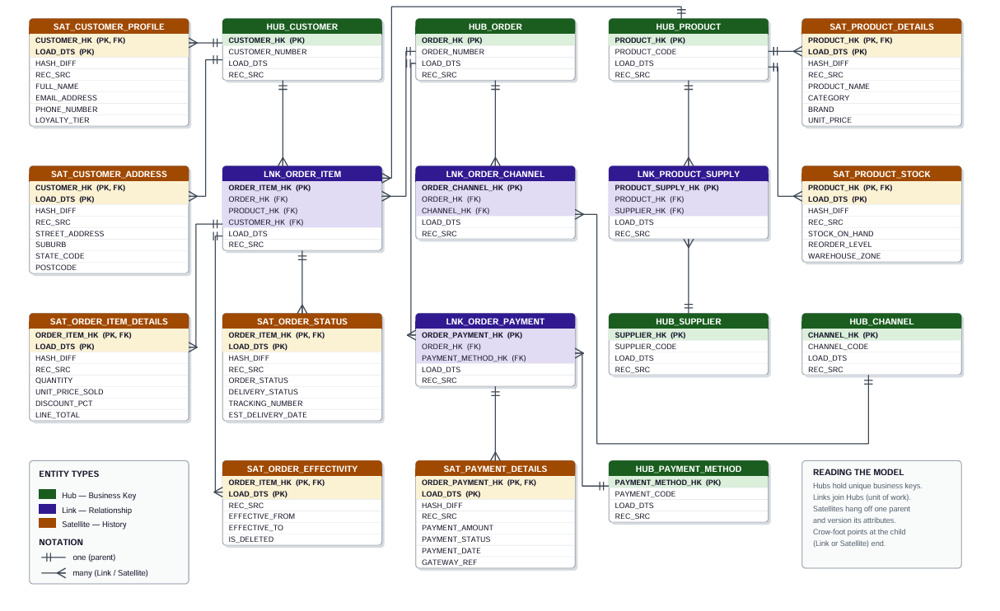

# Data Vault 2.0 — Modelling Guide

> A practical reference covering every entity type, core rules, naming conventions, and real-world examples for building a Data Vault 2.0 enterprise data warehouse.

---

## Table of Contents

1. [What is Data Vault 2.0?](#what-is-data-vault-20)
2. [Architecture Overview](#architecture-overview)
3. [Entity Types](#entity-types)
   - [Hubs](#hubs)
   - [Links](#links)
   - [Satellites](#satellites)
4. [Other Table Classifications](#other-table-classifications)
5. [Core Rules Summary](#core-rules-summary)
6. [Naming Conventions](#naming-conventions)
7. [Common Field Elements](#common-field-elements)
8. [Deprecated Patterns](#deprecated-patterns)
9. [Real-World Examples](#real-world-examples)
10. [SQL Patterns](#sql-patterns)

---

## What is Data Vault 2.0?

Data Vault 2.0 (DV 2.0) is a data warehouse modelling methodology designed for **agility**, **auditability**, and **scalability**. It separates three fundamental concerns:

| Component | Analogy | Purpose |
|-----------|---------|---------|
| **Hub** | A phone book listing names only | The unique list of business keys |
| **Link** | A marriage certificate connecting two people | The relationships between entities |
| **Satellite** | A medical record noting every visit | Descriptive attributes and their full history |

DV 2.0 is typically used as the **integration and storage layer** (Raw Vault), with Kimball-style star schemas built on top for BI consumption (Information Mart).

```
Source Systems  →  Staging  →  Raw Data Vault  →  Business Vault  →  Information Mart  →  BI Tools
```

The key architectural principle: **INSERT-ONLY**. Nothing in the Raw Vault is ever physically updated or deleted after insertion.

---

## Architecture Overview



```
┌──────────────────────────────────────────────────────────────┐
│                       SOURCE SYSTEMS                          │
│          CRM │ ERP │ Order System │ WFM │ Contact Centre      │
└──────────────────────┬───────────────────────────────────────┘
                       │  raw extract
┌──────────────────────▼───────────────────────────────────────┐
│                    STAGING LAYER  (STG_)                      │
│  Land as-is · apply HARD rules only: type, dedup, hash keys  │
└──────────────────────┬───────────────────────────────────────┘
                       │  insert-only
┌──────────────────────▼───────────────────────────────────────┐
│                  RAW DATA VAULT                               │
│   Hubs (unique keys) │ Links (relationships) │ Satellites     │
│   No business rules  │ Full audit trail      │ INSERT-ONLY    │
└──────────────────────┬───────────────────────────────────────┘
                       │  soft rules
┌──────────────────────▼───────────────────────────────────────┐
│              BUSINESS VAULT  (BHUB_ / BLNK_ / BSAT_)         │
│         Scoring, classification, derived attributes           │
└──────────────────────┬───────────────────────────────────────┘
                       │  disposable, rebuilt on demand
┌──────────────────────▼───────────────────────────────────────┐
│               INFORMATION MART                                │
│     PIT tables │ Bridge tables │ Star schema views / RPTs     │
└──────────────────────┬───────────────────────────────────────┘
                       │
┌──────────────────────▼───────────────────────────────────────┐
│              CONSUMPTION LAYER                                │
│          Power BI │ Tableau │ Excel │ ML Feature Store        │
└──────────────────────────────────────────────────────────────┘
```

---

## Entity Types



### Hubs

A Hub stores the **unique list of one business key**. It is inserted once when the key is first seen and never updated.

**Structure:**

| Column | Type | Description |
|--------|------|-------------|
| `CUSTOMER_HK` (PK) | `BINARY(16)` | Hash of the business key |
| `CUSTOMER_NUMBER` | `VARCHAR(20)` | The natural business key from source |
| `LOAD_DTS` | `DATETIME2` | When first seen in the warehouse |
| `REC_SRC` | `VARCHAR(50)` | Which source system provided this key |

**Hub Rules:**
- Must have at least one business key
- Business key → surrogate is one-to-one
- Cannot contain multiple independent business keys (each gets its own Hub)
- `LOAD_DTS` is an attribute only — never part of the primary key
- `REC_SRC` is never part of the primary key

**Hub Variants:**

| Type | Description |
|------|-------------|
| Standard Hub | The base pattern above |
| Stub Hub | Placeholder when source detail is out of scope — reserves the key slot so Links can reference it now |
| Hierarchical Link | Same Hub referenced twice for parent-child within one entity type |
| Same-As Link | Maps synonym keys from different source systems to a single master key |

---

### Links

A Link records the **unique list of relationships** between two or more Hub keys.

**Structure:**

| Column | Type | Description |
|--------|------|-------------|
| `ORDER_ITEM_HK` (PK) | `BINARY(16)` | Hash of all imported Hub keys combined |
| `ORDER_HK` (FK) | `BINARY(16)` | FK to HUB_ORDER |
| `PRODUCT_HK` (FK) | `BINARY(16)` | FK to HUB_PRODUCT |
| `CUSTOMER_HK` (FK) | `BINARY(16)` | FK to HUB_CUSTOMER |
| `LOAD_DTS` | `DATETIME2` | When this relationship was first seen |
| `REC_SRC` | `VARCHAR(50)` | Source system |

**Link Rules:**
- Must contain two or more Hub keys
- Links are **never temporal** — no begin/end dates (those live in Effectivity Satellites)
- `LOAD_DTS` is an attribute only — never part of the primary key
- The composite key must be unique — one row per unique key combination, for all time
- Links can never depend on other Links — only on Hubs

**Link Variants:**

| Type | Description |
|------|-------------|
| Standard Link | Relationships between two or more entity types |
| Hierarchical Link | Same Hub key imported twice (parent/child within one entity) |
| Same-As Link | Synonym mapping between source system keys |
| Non-Historized Link | Stores immutable facts directly — the one exception to the no-dates rule |
| Exploration Link | Temporary ML/data science links; disposable |

**Granularity:** Always model at the **lowest level of granularity** — adding Hub keys increases detail (e.g. Customer + Order is coarser than Customer + Product + Order).

---

### Satellites

Satellites store **delta-driven descriptive information** — attributes that change over time. A new row is inserted on every change; old rows are never updated or deleted.

**Structure:**

| Column | Type | Description |
|--------|------|-------------|
| `CUSTOMER_HK` (PK, FK) | `BINARY(16)` | Borrowed from the parent Hub |
| `LOAD_DTS` (PK) | `DATETIME2` | Part of PK — identifies this version |
| `HASH_DIFF` | `BINARY(16)` | Hash of all descriptive columns for change detection |
| `REC_SRC` | `VARCHAR(50)` | Source system |
| `EMAIL_ADDRESS` | `NVARCHAR(200)` | Descriptive attribute |
| `PHONE_NUMBER` | `VARCHAR(20)` | Descriptive attribute |

**Satellite Rules:**
- Must import exactly one parent Hub or Link key (never two parents)
- Cannot be snowflaked — attaches directly to its parent only
- `LOAD_DTS` **is** part of the primary key (unlike Hubs and Links)
- Must contain at least one descriptive element
- INSERT-ONLY — no physical updates or deletes, ever
- Reference table lookups use natural keys only — no physical FK constraints

**Split Satellites by rate of change:**

```
SAT_CUSTOMER_PROFILE    ← fast-changing: email, phone, loyalty tier
SAT_CUSTOMER_ADDRESS    ← slow-changing: suburb, state, postcode
SAT_CUSTOMER_DEMOGRAPHICS ← very rarely: date of birth, preferred name
```

**Satellite Variants:**

| Type | Description |
|------|-------------|
| Standard Satellite | The base pattern above |
| Multi-Active Satellite | Multiple simultaneously-active child rows (e.g. 3 addresses at once); PK adds a sub-sequence |
| Effectivity Satellite | Stores begin/end dates for a Hub or Link — the ONLY place temporal ranges live |
| Business Satellite (BSAT) | Business Vault layer; contains computed/derived attributes from soft business rules |

---

## Other Table Classifications

### Point-in-Time (PIT) Tables

PIT tables are **system-driven performance structures** in the Information Mart. They snapshot the correct Satellite `LOAD_DTS` values per Hub/Link key at specific moments in time, enabling fast equi-join queries without scanning full Satellite history.

```sql
-- Without PIT: slow correlated subquery per satellite
WHERE sat.load_dts = (SELECT MAX(load_dts) FROM sat WHERE hk = ? AND load_dts <= ?)

-- With PIT: pure equi-join
WHERE sat.customer_hk = pit.customer_hk
  AND sat.load_dts    = pit.sat_profile_load_dts
  AND pit.snapshot_dts = '2026-06-11 23:59'
```

### Bridge Tables

Bridge tables **pre-join Hub and Link keys** into a single snapshot row, acting as a fact-table skeleton. Analysts query the Bridge instead of navigating Hub → Link → Hub chains manually.

### Reporting Tables (RPT_)

Flat, denormalised, wide tables in the Information Mart. Business rules have been applied. These are what Power BI and Tableau query directly.

### Stand-Alone Tables

Immutable reference data with no history — calendar, time-of-day, country codes.

### Staging Tables

Two-level:
- **Level 1:** Raw data landed as-is from source (hard rules only — typing, dedup, hash key computation)
- **Level 2 (optional):** Pre-computed hash keys and load dates, enabling parallel vault loading

---

## Core Rules Summary

| # | Rule | Detail |
|---|------|--------|
| 1 | **INSERT-ONLY** | No row in the Raw Vault is ever physically updated or deleted |
| 2 | **Hash Keys** | `_HK = MD5 / SHA-256` of the business key(s); deterministic; no sequential lookups |
| 3 | **No dates on Links** | Validity belongs in Effectivity Satellites only |
| 4 | **Split Satellites by rate of change** | Fast and slow attributes in separate tables |
| 5 | **Hard rules before the vault** | Typing, hashing, PII scrubbing happen in staging |
| 6 | **Soft rules after the vault** | Business logic lives in the Business Vault / Information Mart only |
| 7 | **Hub PK = hash of business key only** | `LOAD_DTS` and `REC_SRC` are attributes, never PK components |
| 8 | **Link PK = composite of all imported Hub keys** | `LOAD_DTS` is an attribute, not PK |
| 9 | **Satellite PK = parent key + LOAD_DTS** | Both are required to identify a specific historical version |
| 10 | **No physical FK constraints** | Reference table lookups are implied and resolved at query time |

---

## Naming Conventions

Consistent naming enables ETL automation. The convention must be documented for your specific vault — the below are standard recommendations.

### Table Prefixes

| Entity | Recommended Prefix | Example |
|--------|--------------------|---------|
| Hub | `HUB_` | `HUB_CUSTOMER` |
| Link | `LNK_` | `LNK_ORDER_ITEM` |
| Satellite | `SAT_` | `SAT_CUSTOMER_PROFILE` |
| Effectivity Satellite | `SAT_` + `_EFFECTIVITY` | `SAT_ORDER_EFFECTIVITY` |
| Multi-Active Satellite | `SAT_` | `SAT_SESSION` |
| Hierarchical Link | `HLNK_` | `HLNK_PRODUCT_BUNDLE` |
| Same-As Link | `SAL_` | `SAL_CUSTOMER_MASTER` |
| Point-in-Time | `PIT_` | `PIT_CUSTOMER` |
| Bridge | `BRDG_` | `BRDG_ORDER_SALES` |
| Business Hub | `BHUB_` | `BHUB_CUSTOMER_CLEANSED` |
| Business Link | `BLNK_` | `BLNK_ORDER_ENRICHED` |
| Business Satellite | `BSAT_` | `BSAT_CUSTOMER_SCORED` |
| Staging | `STG_` | `STG_CRM_CUSTOMERS` |
| Reporting | `RPT_` | `RPT_SALES_FACT` |
| Fact (Info Mart) | `FCT_` / `VF_` | `FCT_SALES`, `VF_SALES` |
| Dimension (Info Mart) | `DIM_` / `VDIM_` | `DIM_CUSTOMER`, `VDIM_CUSTOMER` |

### Field Suffixes

| Attribute | Suffix | Example |
|-----------|--------|---------|
| Hash Key | `_HK` | `CUSTOMER_HK` |
| Hash Difference | `_HD` / `HASH_DIFF` | `CONTACT_HD` |
| Load Date Timestamp | `LOAD_DTS` | `LOAD_DTS` |
| Record Source | `REC_SRC` | `REC_SRC` |
| Sub-Sequence | `_SSQN` | `ADDRESS_SSQN` |
| Snapshot DTS | `SNAPSHOT_DTS` | `SNAPSHOT_DTS` |

---

## Common Field Elements

| Field | Required? | Description |
|-------|-----------|-------------|
| **Hash Key** | Optional | MD5/SHA-256 of business key; enables parallel loading without sequential lookups |
| **Business Key** | Required | The natural identifier the business uses — not auto-increment DB IDs |
| **LOAD_DTS** | Required (RDBMS) | When the row was inserted into the vault |
| **REC_SRC** | Required | Which source system delivered the data |
| **HASH_DIFF** | Optional | Hash of all Satellite descriptive columns for efficient change detection |
| **Applied DTS** | Optional | When the business event occurred — differs from LOAD_DTS for late-arriving data |
| **Extract Date** | Optional | When the source system produced the data (before ETL transit) |

**Hash Key vs Sequence ID:**

| | Hash Key ✅ | Sequence ID ❌ (deprecated) |
|-|------------|---------------------------|
| Parallel loading | Yes — computed independently | No — requires central lookup |
| Deterministic | Yes — same input, same hash | No — parallel processes conflict |
| Cross-geography | Works globally | Conflicts across regions |
| Privacy | Send hash only across borders | Sends raw business key |

---

## Deprecated Patterns

These were used in Data Vault 1.0 and must **never** appear in a DV 2.0 model:

### ❌ Sequence ID Surrogate Keys
Auto-incrementing integers cannot be loaded in parallel. Replaced by deterministic hash keys.

### ❌ Satellite Load End-Dates
Storing `load_end_date` required physical `UPDATE` statements on existing rows — not scalable. Use SQL `LEAD()` window functions to compute end-dates at query time, or materialise them in PIT/Bridge tables.

### ❌ Hub and Link Last-Seen Dates
`last_seen_date` on Hubs/Links required physical `UPDATE` statements. Use Effectivity Satellites to track when keys were active or last observed.

> **Root cause of all three:** they require physical `UPDATE` statements. DV 2.0 is **INSERT-ONLY**. No row in the Raw Vault is ever physically modified after insertion.

---

## Real-World Examples

### E-Commerce Order

A customer places an order for a product via a web channel, paying by card:

```
HUB_CUSTOMER  ─────────────┐
HUB_PRODUCT   ──────────── LNK_ORDER_ITEM ──── SAT_ORDER_ITEM_DETAILS
HUB_ORDER     ─────────────┘                   SAT_ORDER_STATUS
                                               SAT_ORDER_EFFECTIVITY
```

**What lands where:**

| Business event | Hub | Link | Satellite |
|----------------|-----|------|-----------|
| New customer CUST-501 | `HUB_CUSTOMER` (1 row) | — | `SAT_CUSTOMER_PROFILE` |
| Order ORD-10001 created | `HUB_ORDER` (1 row) | `LNK_ORDER_ITEM` (1 row) | `SAT_ORDER_ITEM_DETAILS` |
| Customer email changes | No new Hub row | No new Link row | `SAT_CUSTOMER_PROFILE` (new row) |
| Order status → SHIPPED | No new Hub row | No new Link row | `SAT_ORDER_STATUS` (new row) |

### Genesys Contact Centre Call

A voice call flows IVR → queue → agent:

```
HUB_CONVERSATION ─── LNK_CONV_AGENT ─── SAT_AGENT_METRICS
                 ─── LNK_CONV_QUEUE
                 ─── LNK_CONV_FLOW  ─── SAT_FLOW_EXECUTION
                 ─── LNK_CONV_WRAPUP─── SAT_WRAPUP_NOTE
                 ─── SAT_CONVERSATION_DETAILS
                 ─── SAT_SESSION (multi-active: 1 row per participant·session)
                 ─── SAT_SEGMENT (multi-active: 1 row per participant·session·segmentStart)
```

**Async messaging (3-day window):**  
Web message conversations stay OPEN for up to 72 hours. The pipeline re-extracts a rolling 96-hour window daily. Re-delivered unchanged payloads hit identical `HASH_DIFF` values → zero rows inserted. When `conversationEnd` finally arrives, it is just another Satellite version row — no special code path, no updates.

---

## SQL Patterns

See the [`sql/`](./sql/) directory for:

| File | Contents |
|------|----------|
| [`hub_load.sql`](./sql/hub_load.sql) | Insert-new-keys-only Hub load pattern |
| [`link_load.sql`](./sql/link_load.sql) | Idempotent Link load pattern |
| [`satellite_load.sql`](./sql/satellite_load.sql) | HASH_DIFF-driven Satellite load pattern |
| [`pit_build.sql`](./sql/pit_build.sql) | Point-in-Time snapshot build |
| [`star_views.sql`](./sql/star_views.sql) | Information Mart dimension and fact views |
| [`profiling_toolkit.sql`](./sql/profiling_toolkit.sql) | Data profiling queries for any new source table |

---

## Repository Structure

```
data-vault-2-guide/
├── README.md                        ← This file
├── diagrams/
│   ├── dv2_architecture.svg         ← Full layer architecture diagram
│   ├── dv2_ecommerce_erd.png        ← E-commerce Raw Vault ERD
│   ├── dv2_pit_bridge.svg           ← PIT and Bridge table diagram
│   └── dv2_genesys_mapping.svg      ← Genesys API → Vault mapping
├── docs/
│   ├── hub_rules.md                 ← Hub rules 4.0 in full
│   ├── link_rules.md                ← Link rules 5.0 in full
│   ├── satellite_rules.md           ← Satellite rules 6.0 in full
│   ├── naming_conventions.md        ← Field and table naming guide
│   └── deprecated_patterns.md      ← What NOT to do in DV 2.0
└── sql/
    ├── hub_load.sql
    ├── link_load.sql
    ├── satellite_load.sql
    ├── pit_build.sql
    ├── star_views.sql
    └── profiling_toolkit.sql
```

---

## References

- Dan Linstedt, *Data Vault Data Modeling Specification v2.0.2*, 2018
- Hans Hultgren, *Data Vault Modeling Guide*, Genesee Academy, 2012
- [datavaultalliance.com](https://datavaultalliance.com)

---

> **One-line principle:** Hard rules before the vault. Soft rules after. INSERT-ONLY always.
